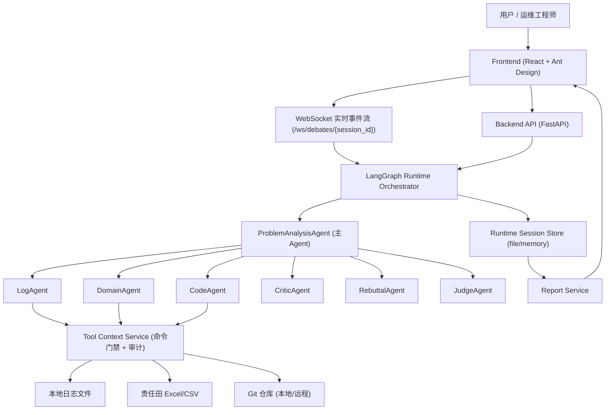
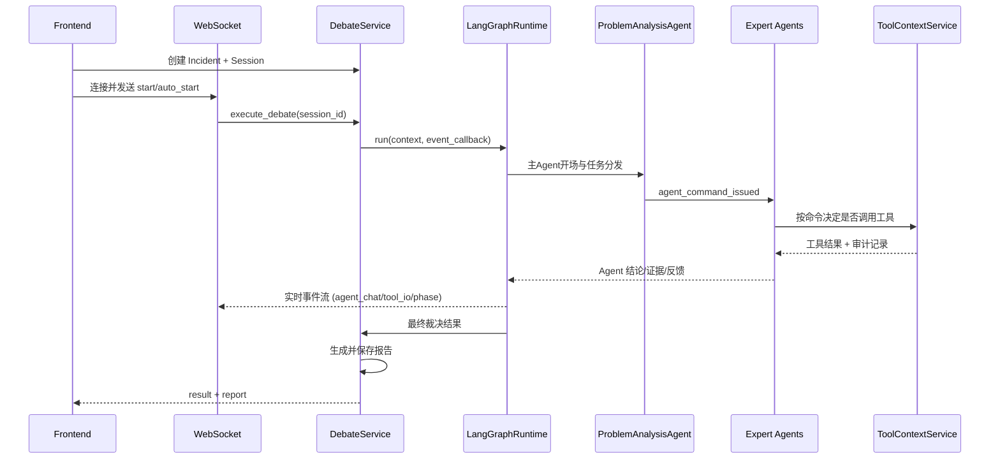

# 生产问题根因分析系统（LangGraph Multi-Agent）

基于 **LangGraph + FastAPI + React** 的生产故障根因分析系统。  
系统通过主 Agent 协调多个专家 Agent（日志/领域/代码/质疑/反驳/裁决）进行多轮讨论，结合责任田资产映射与工具检索，输出结构化结论与报告。

## 1. 当前实现状态

- 已完成底层编排从旧方案迁移到 **LangGraph Runtime**。
- 主 Agent（`ProblemAnalysisAgent`）负责任务拆解、命令分发、收敛决策。
- 前端分析页拆分为三块：
  - `资产映射`
  - `辩论过程`
  - `辩论结果`
- 工具调用已支持：
  - 开关控制
  - 命令驱动（由主 Agent 指令决定是否调用）
  - 审计日志（文件读取/Git 操作/参数摘要）

## 2. 架构概览

### 2.0 系统架构图



### 2.1 运行时链路图



### 2.2 后端

- 框架：`FastAPI`
- 编排：`LangGraph`
- LLM 接入：`langchain-openai (OpenAI-compatible API)`
- 存储：本地文件或内存（默认本地文件）
- 运行模式：WebSocket 实时事件流 + REST 查询

核心路径：

- `backend/app/runtime/langgraph_runtime.py`：运行时编排入口
- `backend/app/runtime/langgraph/`：节点、路由、状态、执行器
- `backend/app/services/debate_service.py`：会话执行与事件沉淀
- `backend/app/services/agent_tool_context_service.py`：Agent 工具上下文、门禁、审计

### 2.3 前端

- 技术栈：`React 18 + TypeScript + Ant Design + Vite`
- 页面：
  - `/` 首页
  - `/incident` 分析页
  - `/history` 历史记录
  - `/assets` 资产视图
  - `/settings` 工具与登录配置

分析页关键文件：

- `frontend/src/pages/Incident/index.tsx`

## 3. Multi-Agent 角色

- `ProblemAnalysisAgent`：主控协调、命令分发、阶段推进
- `LogAgent`：日志证据分析
- `DomainAgent`：接口到领域/聚合根/责任田映射
- `CodeAgent`：代码路径与风险点分析
- `CriticAgent`：质疑与证据缺口识别
- `RebuttalAgent`：反驳与证据补强
- `JudgeAgent`：最终裁决与建议输出

## 4. 分析流程

1. 创建 Incident。
2. 采集上下文并执行接口责任田映射。
3. 主 Agent 先发言并下发命令（`agent_command_issued`）。
4. 被指派 Agent 按命令决定是否调用工具，再执行 LLM 分析。
5. 多 Agent 轮次协作（含质疑/反驳）。
6. JudgeAgent 裁决并生成最终结果。
7. 报告生成并可在历史记录回看全过程。

## 5. 工具调用机制（重点）

当前支持三个专家工具入口：

- `CodeAgent`：Git 仓库检索
- `LogAgent`：本地日志文件读取
- `DomainAgent`：责任田 Excel/CSV 查询

设计约束：

- 工具调用必须在主 Agent 下发命令后触发。
- 命令可显式携带 `use_tool`。
- 未配置工具的 Agent 不展示工具调用记录。
- 每次工具调用会输出审计信息：
  - 命令门禁决策
  - 工具执行状态
  - 核心返回数据摘要
  - I/O 审计轨迹（例如文件读取、Git 命令）

## 6. 快速启动

### 6.1 环境要求

- Python `3.11+`（建议 3.11/3.12）
- Node.js `18+`
- npm

### 6.2 安装依赖

后端：

```bash
cd backend
python3 -m venv .venv
source .venv/bin/activate
pip install -r requirements.txt
```

前端：

```bash
cd frontend
npm install
```

### 6.3 一键启动（推荐）

在项目根目录执行：

```bash
npm run start:all
```

会启动：

- Backend: `http://localhost:8000`
- Frontend: `http://localhost:5173`

日志目录：

- `/Users/neochen/multi-agent-cli_v2/.run/logs/backend.log`
- `/Users/neochen/multi-agent-cli_v2/.run/logs/frontend.log`

停止：

```bash
npm run stop:all
# 或强制释放端口
npm run stop:all:force
```

## 7. 关键配置

主要配置位于：

- `backend/app/config.py`

核心 LLM 配置（当前默认）：

- `LLM_BASE_URL=https://ark.cn-beijing.volces.com/api/coding`
- `LLM_MODEL=kimi-k2.5`
- `LLM_API_KEY=<your_api_key>`

其他常用：

- `LOCAL_STORE_BACKEND=file|memory`
- `LOCAL_STORE_DIR=/tmp/sre_debate_store`
- `DEBATE_MAX_ROUNDS=1`
- `AUTH_ENABLED=false`
- `LOG_FORMAT=json`

## 8. API 速览

前缀：`/api/v1`

- Incident
  - `POST /incidents/`
  - `GET /incidents/`
  - `GET /incidents/{incident_id}`
- Debate
  - `POST /debates/?incident_id=...`
  - `POST /debates/{session_id}/execute`
  - `GET /debates/{session_id}`
  - `GET /debates/{session_id}/result`
  - `POST /debates/{session_id}/cancel`
- Assets
  - `POST /assets/locate`
  - `GET /assets/fusion/{incident_id}`
- Reports
  - `GET /reports/{incident_id}`
  - `POST /reports/{incident_id}/regenerate`
- Settings
  - `GET /settings/tooling`
  - `PUT /settings/tooling`

WebSocket：

- `ws://localhost:8000/ws/debates/{session_id}?auto_start=true`

## 9. 前后端联调与验收

仓库内提供 smoke 脚本：

```bash
node ./scripts/smoke-e2e.mjs
```

会覆盖：

- 首页与后端健康检查
- Incident 创建
- Session 创建
- WebSocket 实时辩论
- 结果与报告拉取
- 资产定位接口

## 10. 常见问题

### Q1: CodeAgent 明明配置了远程 Git，为什么看起来在读本地仓？

已修复：`local_repo_path` 为空时不再误判为当前目录。当前逻辑是：

- `local_repo_path` 非空且存在：走本地
- 否则：走 `repo_url` 远程 clone/fetch

### Q2: Git clone 超时怎么办？

已实现重试与降级：

- clone/fetch 分级超时重试
- 轻量 clone 参数（`--depth 1 --filter=blob:none --single-branch`）
- 远程同步失败时可降级使用已有缓存仓库

### Q3: 为什么有些 Agent 不显示工具调用？

未配置工具的 Agent（例如 Critic/Rebuttal/Judge）默认不展示工具调用记录。

## 11. 仓库结构（精简）

```text
multi-agent-cli_v2/
├── backend/
│   ├── app/
│   │   ├── api/
│   │   ├── runtime/langgraph/
│   │   ├── services/
│   │   ├── models/
│   │   └── tools/
│   ├── tests/
│   └── pyproject.toml
├── frontend/
│   └── src/
├── scripts/
├── plans/
└── README.md
```

## 12. 说明

- 当前实现默认不依赖外部数据库即可运行（本地存储/内存存储）。
- 生产环境请务必通过环境变量注入真实密钥，不要在代码库中明文保存。  
- 若你继续做架构演进，建议优先保持 `state/event/tool-audit` 三条主线的一致性。
