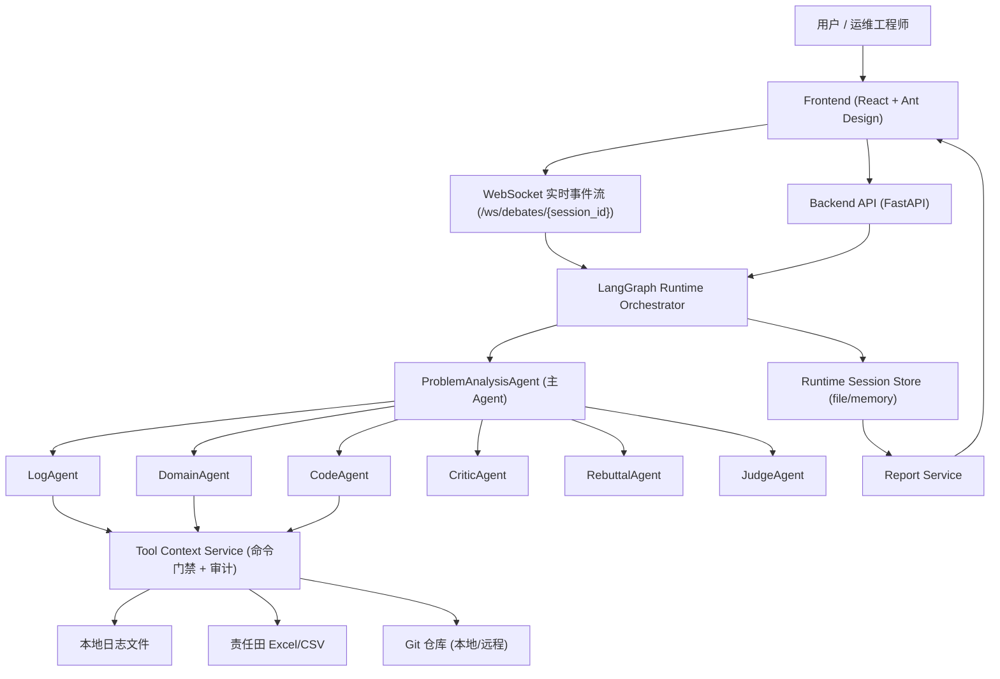
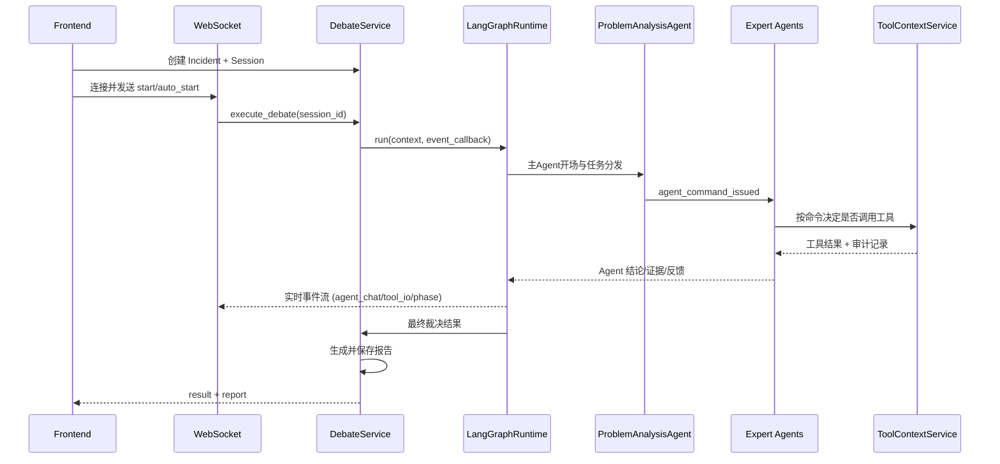

# 生产问题根因分析系统（LangGraph Multi-Agent）

基于 **LangGraph + FastAPI + React** 的生产故障根因分析系统。  
系统通过主 Agent 协调多个专家 Agent（日志/领域/代码/质疑/反驳/裁决）进行多轮讨论，结合责任田资产映射与工具检索，输出结构化结论与报告。

## 1. 当前实现状态

- 已完成底层编排从旧方案迁移到 **LangGraph Runtime**。
- 主 Agent（`ProblemAnalysisAgent`）负责任务拆解、命令分发、收敛决策。
- 运行时已落地结构化状态、`agent_local_state` 私有工作记忆和 checkpoint / resume 基础能力。
- 状态模块当前采用“结构化状态权威写口 + flat 兼容镜像”：
  - `create_initial_state()` 和 `StateAccessor.build_update()` 已改成先写 `phase_state / routing_state / output_state`
  - flat 字段只作为兼容视图，由 `sync_structured_state()` 统一镜像
- 专家 Prompt 已统一切换到 context envelope：
  - `shared_context`
  - `focused_context`
  - `tool_context`
  - `peer_context`
  - `mailbox_context`
  - `work_log_context`
- `analysis_depth_mode` 不再只是轮次别名，当前会同时影响：
  - 默认轮次
  - 专家集合
  - token / timeout 预算
  - 收口质量门槛
- 执行策略与投递方式已拆分：
  - `execution_mode` 只表示分析策略（`standard / quick`）
  - `execution_delivery_mode` 只表示投递方式（`foreground / background`）
  - `requested_execution_mode` 保留用户原始选择，历史页用它展示
- `background` 不再是分析策略，后台执行只改变投递方式，不覆盖分析策略。
- `LogAgent / CodeAgent / DatabaseAgent / MetricsAgent` 已接入多步调查子流程；`deep` 模式下会增加反证复核。
- 无批判模式下已支持：
  - 重复并行分析拦截
  - 基于证据缺口的定向追问
  - 对已形成有效覆盖专家的直接收口
  - `quick` 模式下对 `gateway route not found` 这类本地 404 场景的快速收口
- 标准模式第 2 轮以后会优先触发“定向补证”规则，避免重复全量并行分析。
- 前端分析页拆分为三块：
  - `资产映射`
  - `辩论过程`
  - `辩论结果`
- 历史记录页已展示每个任务的 `开始时间`，优先使用分析会话真正启动时间。
- finalize 收口链路已下沉为显式边界：
  - `FinalizationService` 负责最终载荷补全、人工审核封装和终态事件决策
  - runtime 主类只负责调用 session store 和事件派发
- `judgment_boundary.py / review_boundary.py` 已补齐为稳定 helper：
  - `JudgmentBoundary` 负责 Judge 输出恢复与 final payload 最小合同兜底
  - `ReviewBoundary` 负责等待人工审核状态与 `final_payload.human_review` 的统一结构
- `JudgeAgent` 的最终裁决已附带最小 `claim_graph`：
  - `primary_claim`
  - `supports`
  - `contradicts`
  - `missing_checks`
  - `eliminated_alternatives`
- 工具调用已支持：
  - 开关控制
  - 命令驱动（由主 Agent 指令决定是否调用）
  - 审计日志（文件读取/Git 操作/参数摘要）
- 专家 Agent 已支持可扩展 `skill/tool` 能力：
  - `skill` 支持读取 `metadata.json`（可声明 `required_tools`）
  - `tool` 支持从 `backend/extensions/tools/*/tool.json` 动态加载并执行插件入口

## Code Wiki

- 当前主文档：`docs/wiki/code_wiki_v2.md`
- 旧版新手说明：`docs/wiki/code-wiki.md`

## 2. 架构概览

### 2.0 系统架构图


```mermaid
flowchart TB
    U["用户 / 运维工程师"] --> FE["Frontend (React + Ant Design)"]
    FE --> API["Backend API (FastAPI)"]
    FE --> WS["WebSocket 实时事件流 (/ws/debates/{session_id})"]
    WS --> ORCH["LangGraph Runtime Orchestrator"]
    API --> ORCH

    ORCH --> PA["ProblemAnalysisAgent (主Agent)"]
    PA --> LOG["LogAgent"]
    PA --> DOM["DomainAgent"]
    PA --> CODE["CodeAgent"]
    PA --> CRI["CriticAgent"]
    PA --> REB["RebuttalAgent"]
    PA --> JUDGE["JudgeAgent"]

    LOG --> TOOLS["Tool Context Service (命令门禁 + 审计)"]
    DOM --> TOOLS
    CODE --> TOOLS

    TOOLS --> LOGFILE["本地日志文件"]
    TOOLS --> EXCEL["责任田 Excel/CSV"]
    TOOLS --> GIT["Git 仓库 (本地/远程)"]

    ORCH --> STORE["Runtime Session Store (file/memory)"]
    STORE --> REPORT["Report Service"]
    REPORT --> FE
```

### 2.1 运行时链路图


```mermaid
sequenceDiagram
    participant UI as Frontend
    participant WS as WebSocket
    participant DS as DebateService
    participant LG as LangGraphRuntime
    participant PA as ProblemAnalysisAgent
    participant AG as Expert Agents
    participant TS as ToolContextService

    UI->>DS: 创建 Incident + Session
    UI->>WS: 连接并发送 start/auto_start
    WS->>DS: execute_debate(session_id)
    DS->>LG: run(context, event_callback)
    LG->>PA: 主Agent开场与任务分发
    PA->>AG: agent_command_issued
    AG->>TS: 按命令决定是否调用工具
    TS-->>AG: 工具结果 + 审计记录
    AG-->>LG: Agent 结论/证据/反馈
    LG-->>WS: 实时事件流 (agent_chat/tool_io/phase)
    LG->>DS: 最终裁决结果
    DS->>DS: 生成并保存报告
    DS-->>UI: result + report
```

### 2.2 后端

- 框架：`FastAPI`
- 编排：`LangGraph`
- LLM 接入：`langchain-openai (OpenAI-compatible API)`
- 存储：本地文件或内存（默认本地文件）
- 运行模式：WebSocket 实时事件流 + REST 查询

核心路径：

- `backend/app/runtime/langgraph_runtime.py`：运行时编排入口
- `backend/app/runtime/langgraph/`：节点、路由、状态、执行器
- `backend/app/services/debate_service.py`：会话执行与事件沉淀
- `backend/app/services/agent_tool_context_service.py`：Agent 工具上下文、门禁、审计
- `backend/app/runtime/langgraph/services/state_transition_service.py`：阶段状态回写与快照合并
- `backend/app/runtime/langgraph/services/judgment_boundary.py`：Judge 边界 helper
- `backend/app/runtime/langgraph/services/review_boundary.py`：人工审核边界 helper

### 2.3 前端

- 技术栈：`React 18 + TypeScript + Ant Design + Vite`
- 页面：
  - `/` 首页
  - `/incident` 分析页
  - `/history` 历史记录
  - `/assets` 资产视图
  - `/settings` 工具与登录配置

分析页关键文件：

- `frontend/src/pages/Incident/index.tsx`
- `frontend/src/pages/History/index.tsx`

## 3. Multi-Agent 角色

- `ProblemAnalysisAgent`：主控协调、命令分发、阶段推进
- `LogAgent`：日志证据分析
- `DomainAgent`：接口到领域/聚合根/责任田映射
- `CodeAgent`：代码路径与风险点分析
- `DatabaseAgent`：数据库侧根因/放大链路排查
- `MetricsAgent`：指标趋势与传播链判定
- `CriticAgent`：质疑与证据缺口识别
- `RebuttalAgent`：反驳与证据补强
- `JudgeAgent`：最终裁决与建议输出
- `VerificationAgent`：验证计划与补证动作
- `RuleSuggestionAgent`：规则建议与案例补充

## 4. 分析流程

1. 创建 Incident。
2. 采集上下文并执行接口责任田映射。
3. 主 Agent 先发言并下发命令（`agent_command_issued`）。
4. 被指派 Agent 先接收自己的 context envelope，再按命令决定是否调用工具。
5. `LogAgent / CodeAgent / DatabaseAgent / MetricsAgent` 在需要时进入多步调查子流程。
6. 路由层按证据缺口决定是整轮并行、定向追问，还是直接切 Judge。
7. 多 Agent 轮次协作（含质疑/反驳）。
8. JudgeAgent 裁决并生成最终结果。
9. 报告生成并可在历史记录回看全过程；报告侧 `confidence` 会复用 Judge 根因的有效置信度口径。

## 5. 工具调用机制（重点）

当前支持四类主要专家工具入口：

- `CodeAgent`：Git 仓库检索
- `LogAgent`：本地日志文件读取
- `DomainAgent`：责任田 Excel/CSV 查询
- `DatabaseAgent`：数据库快照/结构化数据库上下文

设计约束：

- 工具调用必须在主 Agent 下发命令后触发。
- 命令可显式携带 `use_tool`。
- 未配置工具的 Agent 不展示工具调用记录。
- 工具不可用时，专家会回退到共享证据，并明确标记：
  - `context_grounded_without_tool`
  - `degraded`
  - `missing`
- 每次工具调用会输出审计信息：
  - 命令门禁决策
  - 工具执行状态
  - 核心返回数据摘要
  - I/O 审计轨迹（例如文件读取、Git 命令）

## 6. 快速启动

### 6.1 环境要求

- Python `3.11+`（建议 3.11/3.12）
- Node.js `18+`
- npm

### 6.2 安装依赖

后端：

```bash
cd backend
python3 -m venv .venv
source .venv/bin/activate
pip install -r requirements.txt
```

前端：

```bash
cd frontend
npm install
```

### 6.3 一键启动（推荐）

在项目根目录执行：

```bash
npm run start:all
```

会启动：

- Backend: `http://localhost:8000`
- Frontend: `http://localhost:5173`

日志目录：

- `/Users/neochen/multi-agent-cli_v2/.run/logs/backend.log`
- `/Users/neochen/multi-agent-cli_v2/.run/logs/frontend.log`

停止：

```bash
npm run stop:all
# 或强制释放端口
npm run stop:all:force
```

## 7. 关键配置

主要配置位于：

- `config.json`（仓库根目录，LLM 主配置入口）
- `backend/app/config.py`

核心 LLM 配置（推荐在 `config.json` 的 `llm` 节点维护）：

- `llm.base_url`
- `llm.model`
- `llm.api_key`
- `llm.max_retries` / `llm.max_concurrency`
- `llm.timeouts.*` / `llm.queue_timeouts.*`
- `llm.debug.log_full_prompt` / `llm.debug.log_full_response`

说明：

- 后端启动时会自动读取根目录 `config.json` 的 LLM 配置作为默认值。
- 环境变量（含 `.env`）仍可覆盖同名 `LLM_*` 字段，用于部署环境动态注入。

其他常用：

- `LOCAL_STORE_BACKEND=file|memory`
- `LOCAL_STORE_DIR=/tmp/sre_debate_store`
- `DEBATE_MAX_ROUNDS=1`
- `AUTH_ENABLED=false`

### 7.1 本地调试：记录完整 LLM Prompt / Response

当前仓库已在本地开发配置中打开以下开关：

- `LLM_LOG_FULL_PROMPT=true`
- `LLM_LOG_FULL_RESPONSE=true`

位置：

- `/Users/neochen/multi-agent-cli_v2/backend/.env`

作用：

- 保留原有 `prompt_preview` / `response_preview`
- 额外为完整文本生成引用：
  - `prompt_ref`
  - `system_prompt_ref`
  - `response_ref`

这些引用会出现在以下事件中：

- `llm_call_started`
- `llm_request_started`
- `llm_http_request`
- `llm_http_response`
- `llm_call_completed`
- `llm_request_completed`

完整文本落盘目录：

- `/tmp/sre_debate_store/output_refs`

读取完整文本：

```bash
curl http://127.0.0.1:8000/api/v1/debates/output-refs/{ref_id}
```

典型排查流程：

1. 先在 runtime 事件或会话详情里找到 `prompt_ref / response_ref`
2. 再调用 `/api/v1/debates/output-refs/{ref_id}`
3. 查看完整 prompt、system prompt 或完整 response

说明：

- 这两个开关只增加日志审计，不改变原有调度、工具调用和前端流程。
- 生产环境建议默认关闭，仅在本地调试或问题复盘时开启。
- `LOG_FORMAT=json`

## 8. API 速览

前缀：`/api/v1`

- Incident
  - `POST /incidents/`
  - `GET /incidents/`
  - `GET /incidents/{incident_id}`
- Debate
  - `POST /debates/?incident_id=...`
  - `POST /debates/{session_id}/execute`
  - `GET /debates/{session_id}`
  - `GET /debates/{session_id}/result`
  - `POST /debates/{session_id}/cancel`
- Assets
  - `POST /assets/locate`
  - `GET /assets/fusion/{incident_id}`
- Reports
  - `GET /reports/{incident_id}`
  - `POST /reports/{incident_id}/regenerate`
- Settings
  - `GET /settings/tooling`
  - `PUT /settings/tooling`

WebSocket：

- `ws://localhost:8000/ws/debates/{session_id}?auto_start=true`

## 9. 前后端联调与验收

仓库内提供 smoke 脚本：

```bash
node ./scripts/smoke-e2e.mjs
```

可通过 `SMOKE_SCENARIO` 指定典型用例：

- `order-502-db-lock`
- `order-404-route-miss`
- `payment-timeout-upstream`
- `order-502-transaction-scope`

覆盖内容：

- 首页与后端健康检查
- Incident 创建
- Session 创建
- WebSocket 实时辩论
- 结果与报告拉取
- 资产定位接口

## 10. 常见问题

### Q1: CodeAgent 明明配置了远程 Git，为什么看起来在读本地仓？

已修复：`local_repo_path` 为空时不再误判为当前目录。当前逻辑是：

- `local_repo_path` 非空且存在：走本地
- 否则：走 `repo_url` 远程 clone/fetch

### Q2: Git clone 超时怎么办？

已实现重试与降级：

- clone/fetch 分级超时重试
- 轻量 clone 参数（`--depth 1 --filter=blob:none --single-branch`）
- 远程同步失败时可降级使用已有缓存仓库

### Q3: 为什么有些 Agent 不显示工具调用？

未配置工具的 Agent（例如 Critic/Rebuttal/Judge）默认不展示工具调用记录。

## 11. 仓库结构（精简）

```text
multi-agent-cli_v2/
├── backend/
│   ├── app/
│   │   ├── api/
│   │   ├── runtime/langgraph/
│   │   ├── services/
│   │   ├── models/
│   │   └── tools/
│   ├── tests/
│   └── pyproject.toml
├── frontend/
│   └── src/
├── scripts/
├── plans/
└── README.md
```

## 12. 说明

- 当前实现默认不依赖外部数据库即可运行（本地存储/内存存储）。
- 生产环境请务必通过环境变量注入真实密钥，不要在代码库中明文保存。  
- 若你继续做架构演进，建议优先保持 `state/event/tool-audit` 三条主线的一致性。
