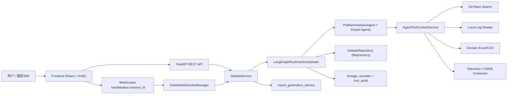
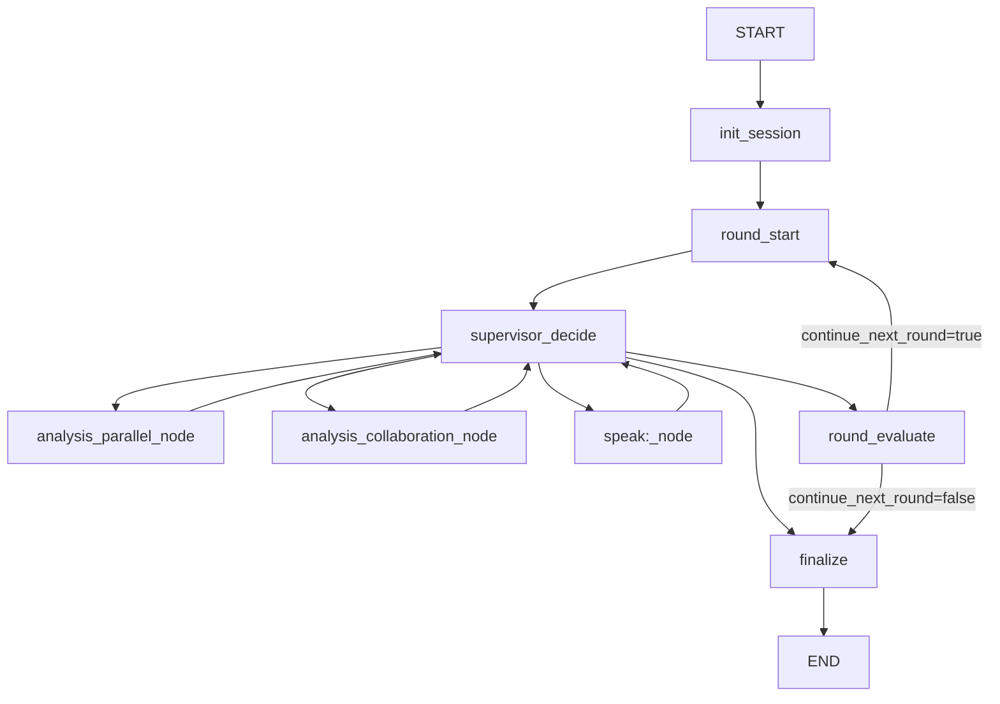
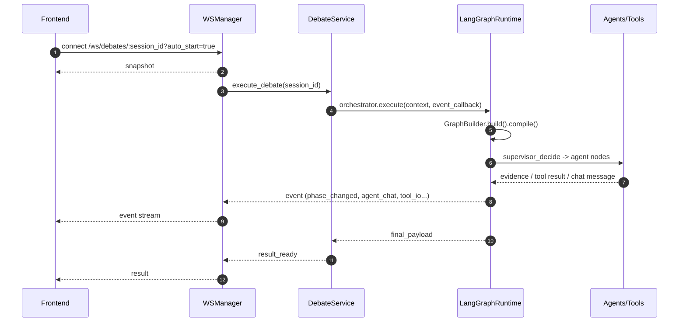
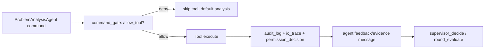

# 生产问题根因分析系统架构图（代码对齐版）

本文档用于固化架构图源，便于后续同步更新 PPT 与技术文档。  
对齐代码基线：

- `backend/app/api/ws_debates.py`
- `backend/app/services/debate_service.py`
- `backend/app/runtime/langgraph_runtime.py`
- `backend/app/runtime/langgraph/builder.py`
- `backend/app/runtime/langgraph/phase_executor.py`
- `backend/app/runtime/langgraph/nodes/supervisor.py`
- `backend/app/services/agent_tool_context_service.py`

## 1. 系统总体架构（Container）

## 2. LangGraph 状态图（Node Topology）

说明：

- `analysis_collaboration_node` 仅在 `DEBATE_ENABLE_COLLABORATION=true` 时加入。
- `speak:<agent>_node` 为动态节点，来自 `agent_sequence()` 与 `supervisor_step_to_node()` 映射。

## 3. 运行时序图（Frontend -> WS -> Debate -> Runtime）

## 4. Agent 工具调用链路（命令门禁）

说明：

- 工具调用受主 Agent 命令与工具开关双重约束。
- 审计信息由后端事件流透出，前端可查看摘要与完整引用信息。
