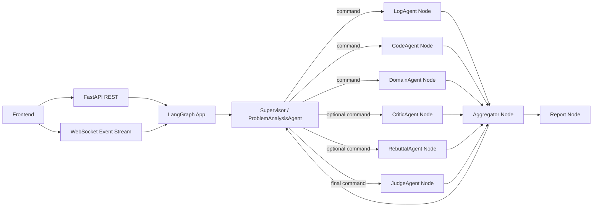

# 生产环境问题根因分析智能体改进设计（Brainstorming）

> 范围：仅使用本地文件/内存存储，不引入外部数据库。  
> 目标：在“快速定位生产问题根因”场景下，提升多 Agent 协作质量、工具可用性、前端可解释性和整体稳定性。  
> 时间：2026-03-01

---

## 1. 现状快照（基于当前代码）

### 1.1 已具备能力

- 后端已采用 LangGraph 执行主流程，入口为 `backend/app/runtime/langgraph_runtime.py`。
- 已有主 Agent + 专家 Agent 体系，支持命令下发、反馈、工具开关、事件流输出。
- 已有工具配置与审计基础：
  - `CodeAgent`：Git 仓检索（本地/远程 clone）
  - `LogAgent`：本地日志文件读取
  - `DomainAgent`：责任田文档查询（Excel/CSV）
- 前端分析页已拆为“输入故障信息/资产映射/辩论过程/辩论结果”步骤，文件在 `frontend/src/pages/Incident/index.tsx`。

### 1.2 核心问题（仍有改进空间）

1. `LangGraphRuntimeOrchestrator` 仍是超大类（2100+ 行），职责过重，影响维护和测试。  
2. 状态存在“双轨”：`messages` 与 `history_cards` 同时维护，语义重叠。  
3. Agent 工厂与实际执行路径并不统一：`AgentFactory` 与 `execution.py` 的直连 LLM 并存。  
4. 并行与协作部分仍有“手工编排”痕迹，未完全发挥 LangGraph 原生 fan-out/fan-in 表达能力。  
5. 前端 `Incident` 页面单文件过大（复杂事件解析、去重、渲染耦合），重复展示与 JSON 泄漏风险高。  
6. 端到端观测指标不完整：缺统一 trace/span、token 消耗、阶段耗时 SLA 仪表。  

---

## 2. 业界最佳实践对标（摘要）

结合主流多 Agent/工作流实践，建议采用以下基线：

1. 使用共享状态 + 显式路由 + checkpoint 恢复（LangGraph 推荐）。  
2. 使用结构化输出（schema）作为 Agent 协作协议，避免文本解析脆弱性。  
3. 使用“监督者（Supervisor）+ 专家（Specialists）+ 聚合器（Aggregator）”三层职责。  
4. 使用显式消息协议（command/evidence/question/feedback）而非隐式拼接 prompt。  
5. 将工具调用能力做成“可观测的动作”而非黑盒（前端可见、日志可审计、结果可追溯）。  
6. 将“推理过程 UI”与“最终结论 UI”分离，支持折叠摘要 + 展开全文。  

---

## 3. 架构演进方案对比（2-3 个方案）

### 方案 A：LangGraph 原生 Supervisor + 并行子图（推荐）

**思路**
- 保留现有 LangGraph 主干，继续演进到“标准节点函数 + Send 并行 + 聚合节点”。
- 统一状态：以 `messages` 为会话主通道，`evidence/commands` 为结构化附加状态。
- 主 Agent 只做：拆题、派单、收敛决策。

**优点**
- 与现代码兼容度最高，重构风险可控。
- 可分阶段迁移，不中断现有 API/前端。
- 利于稳定性治理（超时、重试、降级）与可观测建设。

**缺点**
- 需要持续清理历史兼容逻辑，过渡期双轨代码会并存一段时间。

### 方案 B：多子图（Subgraph）分域编排

**思路**
- 将“日志分析、代码分析、领域映射、裁决汇总”拆成多个子图，主图仅编排子图。

**优点**
- 领域隔离更清晰，便于团队并行开发。

**缺点**
- 图间状态映射复杂度更高，调试门槛高于方案 A。

### 方案 C：事件驱动 Actor Runtime（替换图式编排）

**思路**
- 以消息总线和 Actor 模型替代 LangGraph 路由。

**优点**
- 适合超大规模异步系统。

**缺点**
- 与当前系统偏离大，迁移成本和回归风险高，不适合当前阶段。

### 推荐结论

- 采用 **方案 A（主）+ 方案 B（中期补充）**。  
- 先在现有 LangGraph Runtime 内完成标准化，再按能力域逐步子图化。

---

## 4. 多 Agent 技术架构优化（对应诉求 1）

### 4.1 目标架构



### 4.2 关键改造点

1. **Orchestrator 去中心化**  
- 现状：`backend/app/runtime/langgraph_runtime.py` 职责过重。  
- 改造：拆分为 4 个核心模块。  
  - `graph_app.py`：图定义与编译
  - `agent_nodes.py`：Agent 节点执行
  - `route_policy.py`：路由决策
  - `event_bus.py`：事件标准化与派发

2. **状态模型收敛**  
- 保留 `messages` 作为对话主线。  
- `history_cards` 降级为“前端展示投影”，由 reducer 从 `messages+agent_outputs` 派生。  
- 建议状态形态：

```python
class DebateState(MessagesState):
    context: dict
    commands: dict[str, dict]
    agent_outputs: dict[str, dict]
    mailbox: dict[str, list[dict]]
    route: dict
    metrics: dict
    final_result: dict | None
```

3. **并行执行标准化**  
- 对 `LogAgent/CodeAgent/DomainAgent` 使用 fan-out/fan-in 模式。
- 并行后进入统一聚合节点，避免每个节点自行修改过多全局字段。

4. **命令协议化（主 Agent -> 专家 Agent）**
- 固定结构：`task`, `focus`, `expected_output`, `use_tool`, `deadline_ms`。
- 固定反馈：`status`, `summary`, `evidence_refs`, `confidence`, `open_questions`。

5. **LLM Gateway 统一**
- 所有模型调用统一经 `execution.py` 的网关层；
- 统一记录请求/响应日志字段：`event_id/session_id/agent/model/timeout/retry/token`。

6. **超时与重试分级策略**
- Analysis Agent：短超时 + 快速重试（强调吞吐）。
- Judge/Report：长超时 + 低重试（强调质量）。
- 降级规则：不允许“无模型结论直接出报告”。

---

## 5. 功能模块优化与新增子 Agent（对应诉求 2）

### 5.1 功能模块优化清单

1. **资产映射模块**
- 当前：责任田命中结果在事件流中可见，但结构化复用不足。
- 改造：将映射产物转为标准 `AssetMappingResult`，并作为主 Agent 首轮强输入。

2. **辩论编排模块**
- 当前：已具备命令流，但仍偏“流程驱动”。
- 改造：主 Agent 基于“未决问题列表”动态派单，直到 `JudgeAgent` 置信收敛。

3. **报告模块**
- 当前：已可生成报告，但前端呈现偏文档化。
- 改造：报告拆成可视化 section（根因/证据/影响/动作项），支持复制和导出。

### 5.2 可新增子 Agent（建议先加 4 个）

| Agent | 价值 | 输入 | 输出 | 依赖工具 |
|---|---|---|---|---|
| `MetricsAgent` | 识别 CPU/内存/QPS/错误率异常窗口 | 监控快照/日志 | 时间窗异常结论、峰值证据 | Prometheus/本地监控导出 |
| `TraceAgent` | 分布式调用链断点定位 | traceId/span 日志 | 慢点/失败点拓扑证据 | tracing API/trace 文件 |
| `ConfigAgent` | 识别配置变更导致故障 | 配置文件/发布记录 | 可疑配置差异、风险等级 | Git diff + 配置仓 |
| `ChangeAgent` | 识别最近发布与回滚关联 | 发布流水/commit | 变更候选清单、回滚建议 | CI/CD API + Git |
| `RunbookAgent` | 匹配历史处置经验 | 本地 runbook/md 案例 | SOP 建议、缺失检查项 | markdown 检索 |
| `VerificationAgent` | 输出修复后验证计划 | Judge 结论 | 验证步骤、回归清单 | 内置模板 |

**首批优先顺序**：`MetricsAgent`、`ChangeAgent`、`VerificationAgent`、`RunbookAgent`。

---

## 6. Agent 能力扩展（对应诉求 3）

### 6.1 工具调用能力升级

1. **工具选择由命令驱动**
- 主 Agent 命令中明确 `use_tool` 与 `tool_targets`。
- 专家 Agent 根据命令和本地开关决定调用，禁止越权调用。

2. **工具调用结果结构化**
- 统一 `ToolResult`：`status/summary/data_preview/data_full/audit`。
- 前端展示“摘要优先、详情可展开”。

3. **工具调用真实性证明**
- 必须输出审计轨迹：
  - 文件读取：路径、行数、关键片段 hash
  - Git 调用：命令、返回码、耗时、stdout/stderr preview
  - HTTP 调用：URL（脱敏）、状态码、耗时

### 6.2 推理质量能力升级

1. **证据图谱化**
- 将每条结论绑定证据引用 ID，形成 `claim -> evidence -> source`。
- Judge 输出必须引用至少 2 条跨源证据。

2. **自检机制**
- 每个 Agent 输出 `confidence_reason` 与 `missing_info`。
- 主 Agent 将 `missing_info` 汇总为下一轮派单依据。

3. **反事实校验**
- CriticAgent 产出“最强反例”；RebuttalAgent 必须逐条回应。

4. **成本与时延优化**
- Prompt 压缩（仅携带最近 N 条核心观点）。
- 结果缓存（同一 session + 相同命令 + 相同上下文摘要命中缓存）。
- 并发上限可配置（按模型 QPS 限额动态调整）。

---

## 7. 前端交互展示优化（对应诉求 4）

### 7.1 信息架构

保留三大主标签页，但明确职责边界：

1. `资产映射`
- 仅展示责任田映射结果、置信度、命中理由、责任团队。
- 未产出时展示友好状态文案，不出现空白页。

2. `辩论过程`
- Discord 风格消息流。
- 消息类型拆分渲染：
  - 命令卡（主 Agent -> 专家）
  - 分析卡（专家结论）
  - 工具卡（调用摘要 + 审计）
  - 反馈卡（专家 -> 主 Agent）

3. `辩论结果`
- 仅展示主 Agent 最终结论与 Judge 裁决。
- 报告以卡片化 section 展示，不直接裸露 Markdown。

### 7.2 重复展示与 JSON 泄漏治理

1. 后端生成稳定 `message_id`，前端仅按 `message_id` 去重。  
2. 事件展示与聊天展示分层：`event_log` 原始事件不直接进入聊天流。  
3. 对 LLM 输出做“结构化提炼优先”，非结构化文本只进“事件明细”。

### 7.3 可用性增强

1. 会话状态条：资产映射 -> 派单 -> 专家执行 -> 裁决 -> 报告。  
2. 每条消息支持“摘要/展开”双态。  
3. 所有时间统一显示 `Asia/Shanghai`，并标注“北京时间”。  
4. 失败态可重试：支持“仅重跑失败 Agent”而非整场重跑。

---

## 8. 落地实施方案（P0-P4，含文件级实现建议）

## P0（稳定性与可观测，1-2 周）

**目标**：先解决“看不见、追不清、超时难定位”问题。  
**改造点**
- 统一 LLM 日志字段与中文可读日志。
- 引入消息唯一 ID，修复前端重复展示根因。
- 强制“无有效 LLM 结论不出报告”。

**重点文件**
- `backend/app/runtime/langgraph/execution.py`
- `backend/app/runtime/langgraph/event_dispatcher.py`
- `backend/app/services/debate_service.py`
- `frontend/src/pages/Incident/index.tsx`

**验收标准**
- 一次分析全链路可看到：命令 -> 调用 -> 响应 -> 结论。
- 辩论过程无重复消息，JSON 不直出到聊天主视图。

## P1（架构收敛，2-3 周）

**目标**：将“可运行”提升为“可维护、可测试”。  
**改造点**
- 拆分 orchestrator（图构建/路由/执行/事件）。
- 状态收敛到单一主状态模型，`history_cards` 仅保留展示投影。
- 统一 AgentFactory 与直连 LLM 路径（选一条主路径并清理遗留）。

**重点文件**
- `backend/app/runtime/langgraph_runtime.py`（减薄）
- `backend/app/runtime/langgraph/builder.py`
- `backend/app/runtime/langgraph/state.py`
- `backend/app/runtime/agents/factory.py`

**验收标准**
- 关键模块具备单元测试。
- `langgraph_runtime.py` 体积显著下降（建议 < 900 行）。

## P2（Agent 能力扩展，2-4 周）

**目标**：让结论质量和覆盖面可持续提升。  
**改造点**
- 新增 `MetricsAgent`、`ChangeAgent`、`RunbookAgent`、`VerificationAgent`。
- 标准化命令协议与反馈协议。
- 引入证据引用 ID 与证据图谱化输出。

**重点文件**
- `backend/app/runtime/langgraph/specs.py`
- `backend/app/runtime/langgraph/prompts.py`
- `backend/app/services/agent_tool_context_service.py`
- `backend/app/tools/*.py`

**验收标准**
- 新 Agent 能在前端看到命令、执行、证据、反馈全流程。
- 裁决报告中包含跨源证据引用。

## P3（前端体验升级，1-2 周）

**目标**：降低认知负担，提升研判效率。  
**改造点**
- 拆分 `Incident` 页面为容器 + 子组件（消息流/映射/结果/报告）。
- 对话 UI 卡片化，支持摘要与展开。
- 增加阶段耗时、失败原因、重试入口。

**重点文件**
- `frontend/src/pages/Incident/index.tsx`
- `frontend/src/components/incident/*`（新增）
- `frontend/src/styles/global.css`

**验收标准**
- 首屏可在 5 秒内看懂当前分析阶段。
- 工具调用内容在聊天流中可验证真实性。

## P4（质量体系与演进，持续）

**目标**：建立可持续优化闭环。  
**改造点**
- 建立故障场景回放集（本地 md/json）。
- 增加 E2E smoke + 回归对比（成功率、耗时、置信分布）。
- 引入 SLO 看板：分析成功率、P95 时长、超时率、重试率。

**重点文件**
- `scripts/smoke-e2e.mjs`
- `plans/test-matrix.md`（扩展）
- `plans/operations-runbook.md`（扩展）

---

## 9. 关键指标（建议作为后续验收 KPI）

- 分析成功率 >= 98%（非取消场景）。
- P95 全流程时长 <= 8 分钟。
- LLM 超时率 <= 3%。
- 无效结论率（“需要进一步分析”）<= 5%。
- 责任田命中率（可命中样本）>= 85%。
- 前端重复消息率 < 0.5%。

---

## 10. 立即可执行的下一步（建议）

1. 先做 P0：统一日志与 message_id 去重，确保线上可观测。  
2. 并行做 P1 设计拆分：先切 `event/route/node` 三块，最后减薄 orchestrator。  
3. P2 起引入 `MetricsAgent + ChangeAgent`，先做最小可用工具链。  
4. 前端把“聊天卡片组件”独立出来，先解决重复展示和 JSON 泄漏。  

---

## 参考资料（业界实践）

- LangGraph 官方文档（多 Agent / Supervisor / persistence / interrupts）  
  - https://langchain-ai.github.io/langgraph/  
  - https://docs.langchain.com/oss/python/langgraph/workflows-agents  
  - https://docs.langchain.com/oss/python/langgraph/thinking-in-langgraph
- AutoGen 官方文档（多 Agent 对话模式）  
  - https://microsoft.github.io/autogen/
- OpenTelemetry 官方文档（分布式追踪与可观测标准）  
  - https://opentelemetry.io/docs/
- Google SRE Workbook（故障响应与事后复盘实践）  
  - https://sre.google/workbook/

