# 生产问题根因分析系统 Code Wiki（新手完整版）

更新时间：2026-03-05  
适用范围：`/Users/neochen/multi-agent-cli_v2`

---

## 0. 先看这 3 句话（给新手）

1. 这是一个“多 Agent 协作排障系统”，不是单一聊天机器人。  
2. LLM 负责推理，系统代码负责流程控制（路由、超时、审计、降级、收敛）。  
3. 每个 Agent 的执行都走固定流水线：**接收命令 -> 工具门禁 -> 工具上下文 -> Skill 上下文 -> LLM 推理 -> 结构化输出 -> 回写状态**。

---

## 1. 这个项目到底在做什么

项目目标：把生产故障分析过程做成“可控、可解释、可回放”的系统。

- 可控：主 Agent（ProblemAnalysisAgent）先下命令，专家 Agent 后执行。
- 可解释：每次工具调用与 Skill 命中都有审计记录。
- 可回放：会话事件与 checkpoint 落盘，前端可恢复展示。
- 可收敛：最终输出是结构化结果，不是散文聊天。

---

## 2. 代码结构地图（从哪里读起）

```text
backend/app/
  api/                             # REST + WebSocket
  services/
    debate_service.py              # 会话主流程（资产采集、运行时执行、报告）
    agent_tool_context_service.py  # 工具上下文 + 命令门禁 + Skill 合并
    agent_skill_service.py         # Skill 加载/匹配/选择
  runtime/
    langgraph_runtime.py           # LangGraph 运行时总编排
    langgraph/builder.py           # Graph 节点和边
    langgraph/nodes/               # supervisor/agent 节点执行
    langgraph/execution.py         # LLM 调用、超时、重试、降级
    langgraph/routing_*            # 路由策略与规则引擎
    session_store.py               # 会话和事件落盘
    task_registry.py               # 心跳与恢复
    trace_lineage/recorder.py      # 审计轨迹
  models/tooling.py                # 工具+Skill 配置模型
  repositories/tooling_repository.py # tooling_config.json 持久化
frontend/src/
  pages/Incident/index.tsx         # 分析主页面（实时事件、工具/skill展示）
backend/skills/
  */SKILL.md                       # 本地 Skill 文档库
```

### 2.1 代码分层架构图（阅读导航）

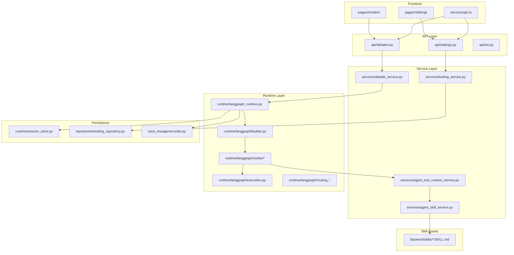

建议阅读顺序：

1. `backend/app/services/debate_service.py`
2. `backend/app/runtime/langgraph_runtime.py`
3. `backend/app/runtime/langgraph/nodes/supervisor.py`
4. `backend/app/runtime/langgraph/phase_executor.py`
5. `backend/app/services/agent_tool_context_service.py`
6. `backend/app/services/agent_skill_service.py`
7. `frontend/src/pages/Incident/index.tsx`

---

## 3. 端到端架构（前端到 Agent）

### 3.1 总体架构图

```mermaid
flowchart LR
    U[用户/SRE] --> FE[Frontend Incident 页面]
    FE --> WS[WebSocket /ws/debates/{session_id}]
    FE --> API[FastAPI REST]

    WS --> DS[DebateService.execute_debate]
    API --> DS

    DS --> ASSET[资产采集 + 责任田映射]
    DS --> ORCH[LangGraphRuntimeOrchestrator]

    ORCH --> GRAPH[GraphBuilder + Nodes]
    GRAPH --> AGENTS[ProblemAnalysisAgent + Expert Agents]
    AGENTS --> TOOLCTX[AgentToolContextService]
    TOOLCTX --> SKILL[AgentSkillService]
    AGENTS --> LLM[ChatOpenAI]

    ORCH --> STORE[session_store/task_registry/lineage]
    STORE --> WS
    WS --> FE
```

### 3.2 运行时时序图

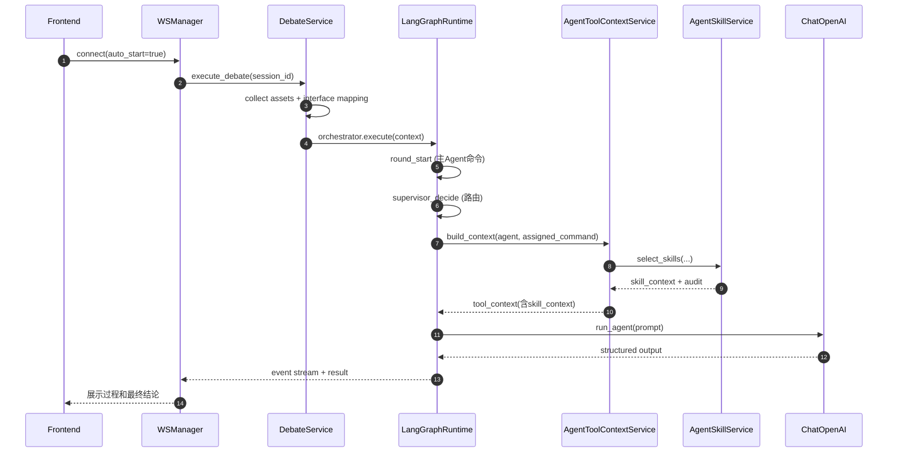

---

## 4. LangGraph 图与调度机制

### 4.1 节点拓扑

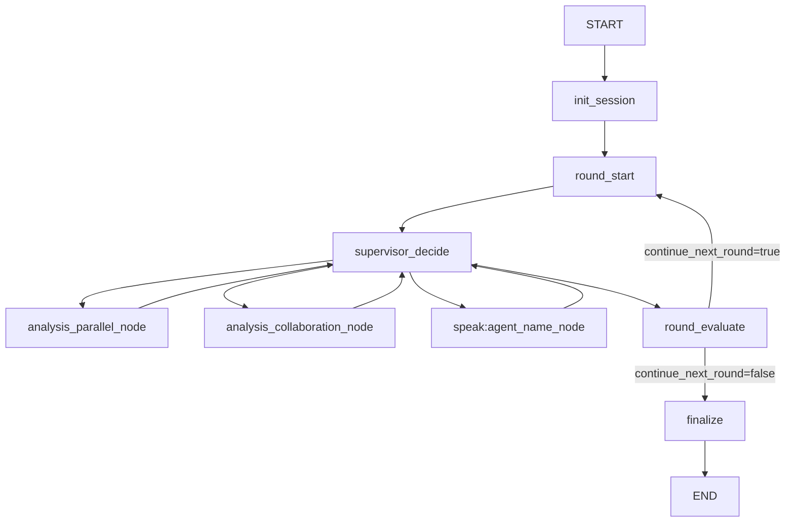

说明：

- 动态节点由 `agent_sequence()` 决定。
- `supervisor_decide` 是路由中枢，最终把 `next_step` 映射到具体 node。
- `analysis_collaboration_node` 由 `DEBATE_ENABLE_COLLABORATION` 开关控制。

### 4.2 路由策略（HybridRouter）

执行顺序：

1. Seeded（先用主 Agent 开场预置步骤）。
2. Consensus shortcut（Judge 置信度达阈值直接收敛）。
3. 分析覆盖后强制进入 Critic/Rebuttal/Judge（防止无限并行补充）。
4. 预算保护（超步数触发 rule-based 回退）。
5. Dynamic LLM routing（主 Agent 作为会议主持路由）。
6. 异常回退 rule-based。

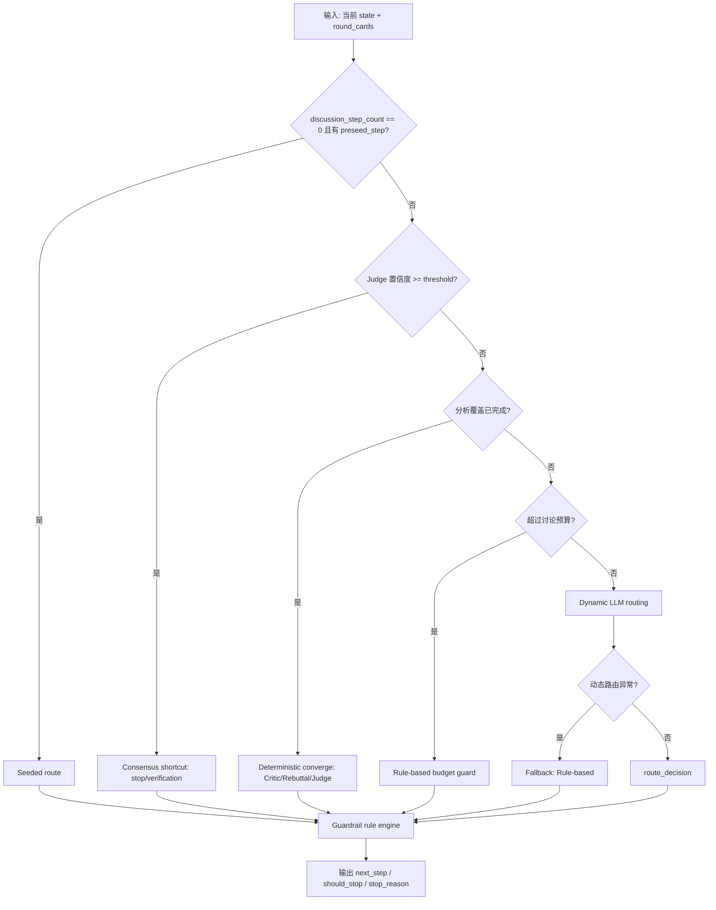

Guardrail 规则引擎在 `routing/rule_engine.py + rules_impl.py`，核心规则包括：

- `ConsensusRule`
- `BudgetRule`
- `RepetitionRule`
- `CritiqueCycleRule`
- `PostRebuttalSettleRule`
- `CommanderSettleRule`
- `NoCritiqueRevisitRule`
- `JudgeCoverageRule`

### 4.3 新手最容易困惑的 3 个点（重点补充）

1. **主 Agent 一轮里会被调用两次，不是一次**  
   - 第 1 次在 `round_start`：负责“开场拆解任务 + 下发 commands”。  
   - 第 2 次在 `supervisor_decide`（动态路由模式）：负责“看当前证据后决定下一步 next_step”。  
   - 所以你会在事件里看到主 Agent 多次发言，这是设计行为，不是死循环。

2. **`analysis_parallel_node` 的并行，不是图上多分支并行，而是节点内部并发**  
   - 图上只跳到一个节点 `analysis_parallel_node`。  
   - 进入该节点后，在 `phase_executor.py` 里用 `asyncio.gather(...)` 并发执行多个 analysis Agent。  
   - 所以“并行”发生在节点内部，而不是 LangGraph 外层边并发。

3. **路由不是“纯 LLM 决定”，有多层规则兜底**  
   - `HybridRouter` 会先走预置步骤、共识捷径、预算保护，再尝试动态 LLM 路由。  
   - 动态路由失败会回退到 rule-based。  
   - 最后还会走 guardrail 规则引擎，防止重复调度、超预算不收敛等问题。

### 4.4 调度状态机（`next_step` / `continue_next_round`）

这两个字段是你读调度代码时的“总开关”：

- `next_step`：**本轮内**下一步执行谁（如 `analysis_parallel`、`speak:LogAgent`、`speak:JudgeAgent`）。
- `continue_next_round`：**本轮结束后**是否进入下一轮（`true -> round_start`，`false -> finalize`）。

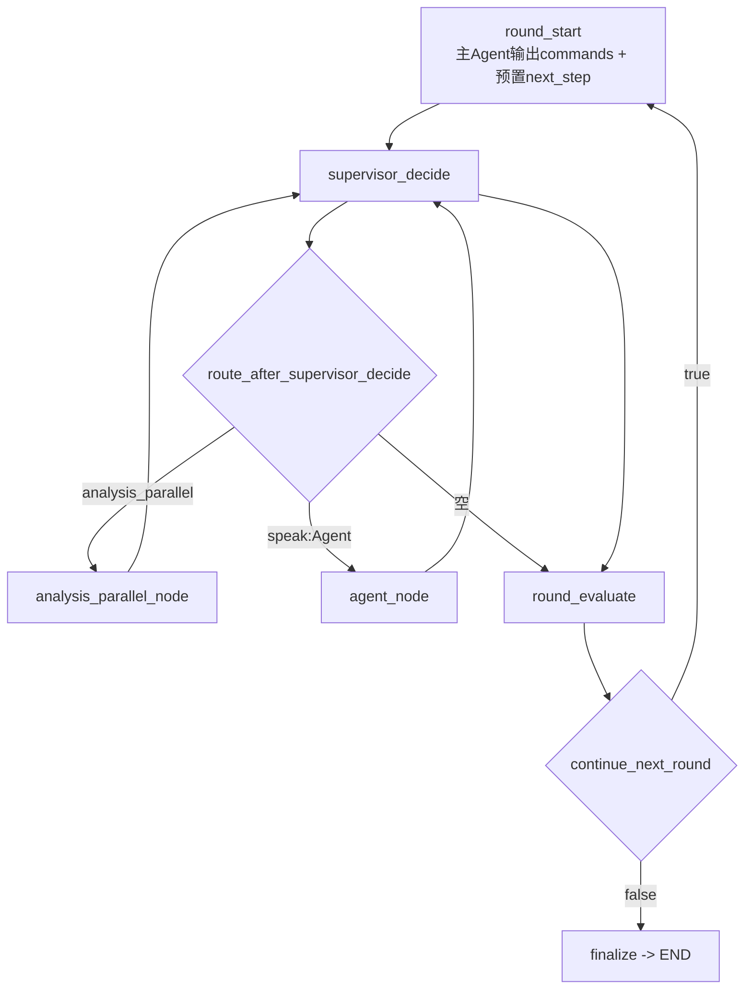

状态变化要点：

1. `round_start` 会先写入一个预置 `next_step`（来自主 Agent 的 commander 输出）。  
2. `supervisor_decide` 可能覆盖这个 `next_step`（动态路由 + 规则修正后）。  
3. 条件边读取 `next_step` 并跳到目标 node。  
4. 节点执行后，状态合并层会清空 `next_step`，避免重复跳转同一步。  
5. `round_evaluate` 只负责决定 `continue_next_round`，不直接选具体 agent。

### 4.5 按代码追一遍调度调用链（建议照这个顺序看）

1. 运行入口：`langgraph_runtime.py` 里 `GraphBuilder.build(...).compile(...).ainvoke(...)`  
2. 图定义：`builder.py` 中 `add_conditional_edges(...)`  
3. Round 开场：`_graph_round_start()`（主 Agent 产生命令）  
4. Supervisor 决策：`nodes/supervisor.py::execute_supervisor_decide()`  
5. 策略实现：`routing_strategy.py::HybridRouter.decide()`  
6. step->node 映射：`routing_helpers.py::supervisor_step_to_node()`  
7. 轮次收敛：`_graph_round_evaluate()` + `route_after_round_evaluate()`

### 4.6 一个典型“单轮调度”例子（帮助建立直觉）

1. `round_start`：主 Agent 下发 `Log/Code/Database...` 命令，并给 `next_step=analysis_parallel`。  
2. `supervisor_decide`：读取当前状态，决定先走并行分析。  
3. `analysis_parallel_node`：内部并发跑多个专家 Agent（`asyncio.gather`）。  
4. 回到 `supervisor_decide`：根据新证据可能调度 `CriticAgent` 或直接 `JudgeAgent`。  
5. `round_evaluate`：若 Judge 置信度达阈值且满足收敛条件，`continue_next_round=false`。  
6. 进入 `finalize`，输出最终结构化结论。

---

## 5. Agent 全目录与职责

当前实现是 13 个 Agent：

1. `ProblemAnalysisAgent`：主控调度、命令分发、收敛决策。
2. `LogAgent`：日志链路与时序分析。
3. `DomainAgent`：责任田/领域映射与业务影响。
4. `CodeAgent`：代码路径与机制锚点分析。
5. `DatabaseAgent`：数据库取证（表/索引/慢SQL/session）。
6. `MetricsAgent`：指标异常窗口与先后关系。
7. `ChangeAgent`：变更窗口关联分析。
8. `RunbookAgent`：案例库与 SOP 建议。
9. `RuleSuggestionAgent`：规则阈值与告警优化建议。
10. `CriticAgent`：挑战结论、发现证据缺口。
11. `RebuttalAgent`：回应质疑、补证或修正。
12. `JudgeAgent`：最终裁决与风险评估。
13. `VerificationAgent`：验证计划（功能/性能/回归/回滚）。

默认顺序：

- analysis：Log/Domain/Code/Database/Metrics/Change/Runbook/RuleSuggestion
- critique：Critic -> Rebuttal（可关闭）
- judgment：Judge
- verification：Verification

### 5.0 Agent 阶段拓扑图（谁在什么时候工作）

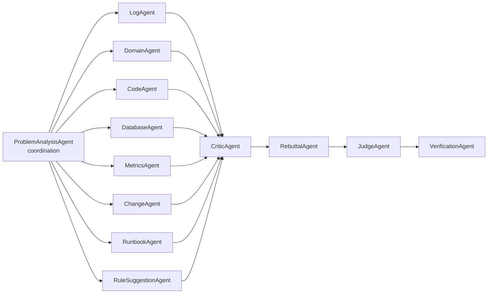

### 5.1 每个 Agent 的能力矩阵（新手版）

| Agent | Phase | 主要职责 | 工具上下文来源 | 默认 Skill Hint（运行时自动补） |
|---|---|---|---|---|
| ProblemAnalysisAgent | coordination | 下命令、控节奏、决定收敛 | `rule_suggestion_toolkit` | `incident-commander` |
| LogAgent | analysis | 日志时序、异常链路、首发错误点 | `local_log_reader` (+ logcloud) | `log-forensics` |
| DomainAgent | analysis | 责任田映射、领域影响分析 | `domain_excel_lookup` (+ cmdb) | `domain-responsibility-mapping` |
| CodeAgent | analysis | 代码锚点、传播机制、风险模式 | `git_repo_search` | `code-path-analysis` |
| DatabaseAgent | analysis | 表/索引/慢SQL/session 取证 | `db_snapshot_reader` | `db-bottleneck-diagnosis`（仅检测到数据库信号时） |
| MetricsAgent | analysis | 指标异常窗口、先后关系 | `metrics_snapshot_analyzer` (+ telemetry/prometheus/loki/grafana/apm) | 无固定默认值 |
| ChangeAgent | analysis | 发布/提交与故障关联分析 | `git_change_window` | `code-path-analysis` |
| RunbookAgent | analysis | 案例检索与 SOP 建议 | `runbook_case_library` | 无固定默认值 |
| RuleSuggestionAgent | analysis | 告警阈值与规则优化建议 | `rule_suggestion_toolkit` | 无固定默认值 |
| CriticAgent | critique | 挑战结论、找证据缺口 | 复用 `metrics` 上下文 | 无固定默认值 |
| RebuttalAgent | rebuttal | 回应质疑、补证与修正 | 复用 `log` 上下文 | `log-forensics` |
| JudgeAgent | judgment | 最终裁决、风险与行动建议 | 复用 `rule_suggestion_toolkit` | `db-bottleneck-diagnosis`（仅检测到数据库信号时） |
| VerificationAgent | verification | 生成功能/性能/回归/回滚计划 | 复用 `metrics` 上下文 | 无固定默认值 |

备注：

- `command_gate.allow_tool=false` 时，上表中的工具与 Skill 都会被跳过。
- 运行模式是 `quick/background/async` 时，`VerificationAgent` 可能被策略跳过。

---

## 6. Agent 的完整工作流程（你要求的重点）

下面这张图就是“新手必须吃透”的主流程：

```mermaid
flowchart TD
    A[Agent 节点被调度] --> B[读取 assigned_command]
    B --> C{有命令吗}
    C -- 否 --> C1[标记 no_command
默认不调用工具/skill]
    C -- 是 --> D[command_gate 判定 allow_tool]

    D --> E{allow_tool ?}
    E -- 否 --> E1[跳过工具与skill
status=skipped_by_command]
    E -- 是 --> F[构建工具上下文
local/remote connectors]

    F --> G[合并 Skill 上下文
agent_skill_service.select_skills]
    G --> H[生成最终 prompt
(含 tool_context + skill_context)]
    H --> I[LLM 调用 execution.call_agent]
    I --> J[parser 结构化归一化]
    J --> K[record_turn + mailbox 回写]
    K --> L[发事件到前端
agent_chat/tool_io/feedback]
    L --> M[supervisor 决定下一步]
```

### 6.1 步骤解读（逐步）

1. **接受命令**：从 `agent_commands[target_agent]` 读取 `task/focus/expected_output/use_tool/database_tables/skill_hints`。  
2. **工具门禁**：`_decide_tool_invocation()` 判断是否允许调用工具。  
3. **工具上下文**：`_build_xxx_context()` 读取日志/仓库/数据库/监控等。  
4. **Skill 上下文**：`_merge_skill_context()` 调用 `agent_skill_service.select_skills()`。  
5. **访问 LLM**：`execution.call_agent()` 负责超时、队列、重试、降级。  
6. **输出结果**：`parsers.py` 统一成结构化 JSON。  
7. **回写状态**：`_record_turn()` + mailbox + event stream。  

---

## 7. Skill 能力：怎么配置、怎么调用（详细）

这是你本次最关心的部分。

## 7.1 Skill 是什么

Skill 是本地 `SKILL.md` 文档，给 Agent 注入“特定分析模板/检查清单/输出契约”。

当前内置目录：`backend/skills/`

- `incident-commander`
- `log-forensics`
- `domain-responsibility-mapping`
- `code-path-analysis`
- `db-bottleneck-diagnosis`

每个 Skill 都是一个目录，核心文件是 `SKILL.md`。

## 7.2 Skill 文档格式（必须）

`SKILL.md` 顶部使用 front matter（YAML 头）：

```yaml
---
name: log-forensics
description: 日志与堆栈取证技能
triggers: 日志,堆栈,trace,timeout,502,error
agents: LogAgent,RebuttalAgent,CriticAgent
---
```

正文一般包含：

- Goal
- Checklist
- Output Contract

`AgentSkillService` 会解析这些字段用于匹配与注入。

## 7.3 Skill 配置在哪里

配置模型：`backend/app/models/tooling.py` 中 `AgentSkillConfig`

字段解释：

- `enabled`：是否启用 Skill 路由。
- `skills_dir`：Skill 根目录，默认 `backend/skills`。
- `max_skills`：单次最多注入多少个 Skill。
- `max_skill_chars`：单个 Skill 注入到 prompt 的最大字符数。
- `allowed_agents`：允许调用 Skill 的 Agent 列表（空=全部允许）。

配置保存位置（file 模式）：

- `/tmp/sre_debate_store/tooling_config.json`

接口：

- `GET /api/v1/settings/tooling`
- `PUT /api/v1/settings/tooling`

### 7.3.1 Skill 配置链路图（前端入口 + 后端持久化）

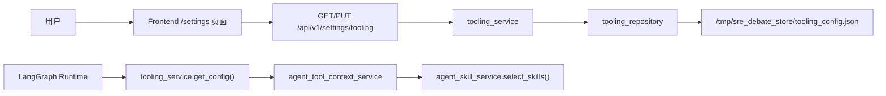

### 7.3.2 前端入口定位图

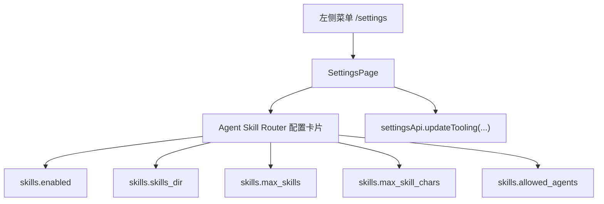

## 7.4 Skill 配置步骤（新手操作）

### 方式 A：通过设置接口（推荐）

1. 先 `GET /api/v1/settings/tooling` 拿当前完整配置。  
2. 修改 `skills` 字段。  
3. `PUT /api/v1/settings/tooling` 回写完整配置。

建议不要只发部分字段直接 PUT，因为你可能把其他工具配置重置为默认值。

示例（核心片段）：

```json
{
  "skills": {
    "enabled": true,
    "skills_dir": "backend/skills",
    "max_skills": 3,
    "max_skill_chars": 1600,
    "allowed_agents": [
      "ProblemAnalysisAgent",
      "LogAgent",
      "CodeAgent",
      "DomainAgent",
      "DatabaseAgent",
      "ChangeAgent",
      "RebuttalAgent",
      "JudgeAgent"
    ]
  }
}
```

### 方式 B：直接改落盘文件

改 `/tmp/sre_debate_store/tooling_config.json`，然后重启服务或触发重新读取配置。

## 7.5 Agent 怎么触发 Skill

Skill 触发有 3 条路径：

1. **命令显式指定 `skill_hints`**（最高优先级）。
2. **主 Agent 自动补默认 skill_hints**：`_enrich_agent_commands_with_skill_hints()`。
3. **无 hints 时走文本匹配**：根据命令文本 + 触发词 + token overlap 评分。

### 7.5.0 Skill 触发决策树

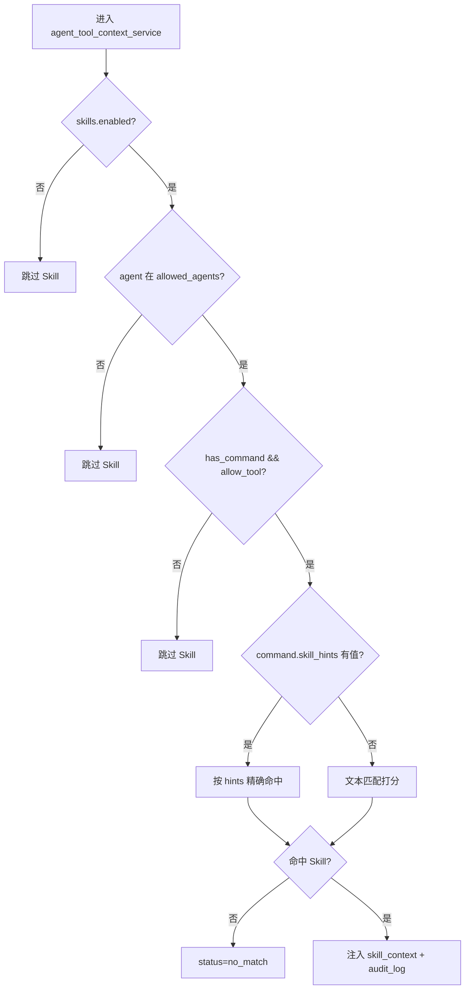

### 7.5.1 `skill_hints` 在命令中的样子

```json
{
  "target_agent": "LogAgent",
  "task": "分析超时和502链路",
  "focus": "首个异常点和放大机制",
  "expected_output": "时间线+证据",
  "use_tool": true,
  "skill_hints": ["log-forensics"]
}
```

### 7.5.2 自动补 hints 的逻辑

运行时会根据 incident 文本信号补默认 hints，例如：

- `LogAgent` -> `log-forensics`
- `CodeAgent` -> `code-path-analysis`
- `DomainAgent` -> `domain-responsibility-mapping`
- 有数据库信号时 `DatabaseAgent`/`JudgeAgent` -> `db-bottleneck-diagnosis`

## 7.6 Skill 调用链（代码级）

1. `ProblemAnalysisAgent` 产生命令（可含 `skill_hints`）。
2. `execute_single_phase_agent()` 把 `assigned_command` 传给工具上下文服务。
3. `AgentToolContextService.build_context()` 先做 `command_gate`。
4. `command_gate` 允许后，`_merge_skill_context()` 调 `agent_skill_service.select_skills()`。
5. `select_skills()`：
   - 过滤 `allowed_agents`
   - 读取 `skills_dir` 下所有 `*SKILL.md`
   - 解析 front matter
   - 优先按 `skill_hints` 精确命中
   - 否则按触发词+token 重叠评分
6. 选中结果写入 `tool_context.data.skill_context`。
7. prompt 构建时把 `tool_context`（含 `skill_context`）喂给 LLM。

### 7.6.1 Skill 调用链流程图

```mermaid
flowchart LR
    A["ProblemAnalysisAgent 生成 commands"] --> B["execute_single_phase_agent"]
    B --> C["build_agent_context_with_tools"]
    C --> D["agent_tool_context_service.build_context"]
    D --> E["command_gate"]
    E --> F["merge_skill_context"]
    F --> G["agent_skill_service.select_skills"]
    G --> H["读取 skills_dir 下 *SKILL.md"]
    H --> I["解析 front matter(name/triggers/agents)"]
    I --> J["返回 skills + summary + audit_log"]
    J --> K["tool_context.data.skill_context"]
    K --> L["PromptBuilder 注入上下文"]
    L --> M["LLM 推理输出"]
```

## 7.7 Skill 是否总会执行

不会。必须同时满足：

1. `skills.enabled=true`
2. 当前 agent 在允许列表内（或列表为空）
3. **有主 Agent 命令**（或含 `skill_hints`）
4. `command_gate.allow_tool=true`

注意：如果主 Agent 命令把 `use_tool=false`，Skill 也会被跳过。

## 7.8 Skill 审计怎么看

Skill 命中后会出现在：

- `agent_tool_context_prepared` 事件的数据里（`skill_context`）
- `audit_log` 中 `tool_name=agent_skill_router`
- 前端 Incident 页面会显示“Skill 路由工具”卡片

调试接口：

- `GET /api/v1/settings/tooling/audit/{session_id}`

---

## 8. Agent + Tool + Skill + LLM 的统一调用链（完整流程图）

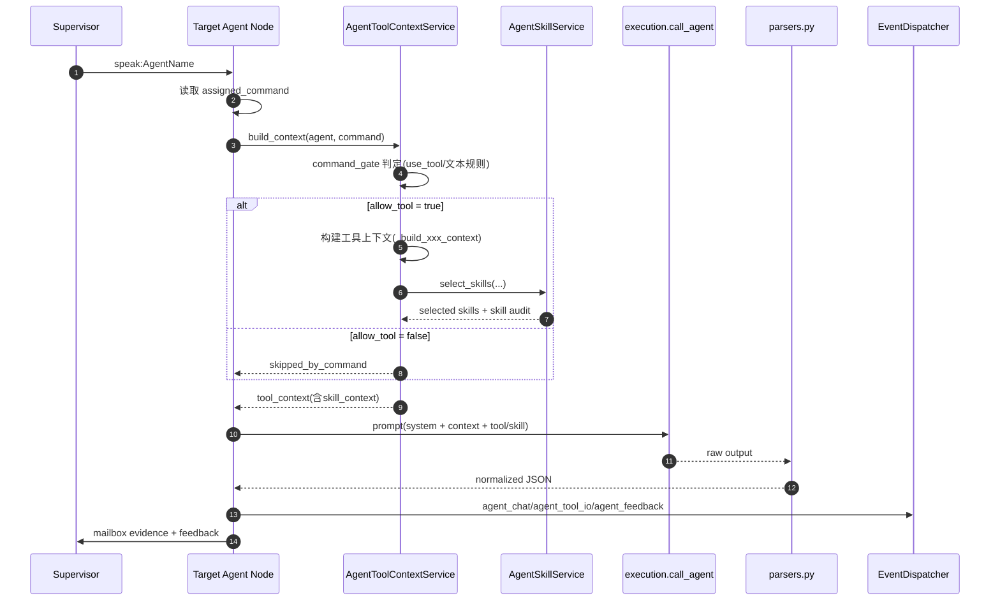

---

## 9. 可靠性与治理机制

### 9.1 超时与降级

- `execution.call_agent` 按 Agent 类型设置 timeout plan。
- 超时可重试，并在重试前压缩 prompt。
- 失败时可生成 fallback turn，避免会话挂死。

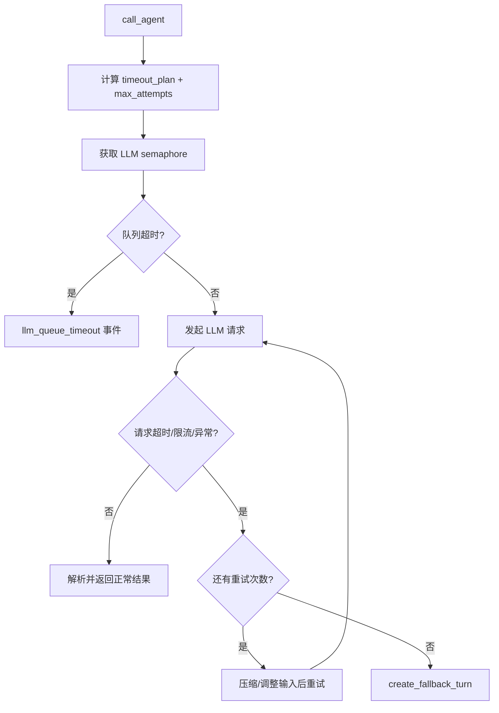

### 9.2 会话终态保证

`DebateService.execute_debate` 保证进入终态：

- `completed`
- `failed`
- `cancelled`

并记录 `last_error_code/last_error_retry_hint`。

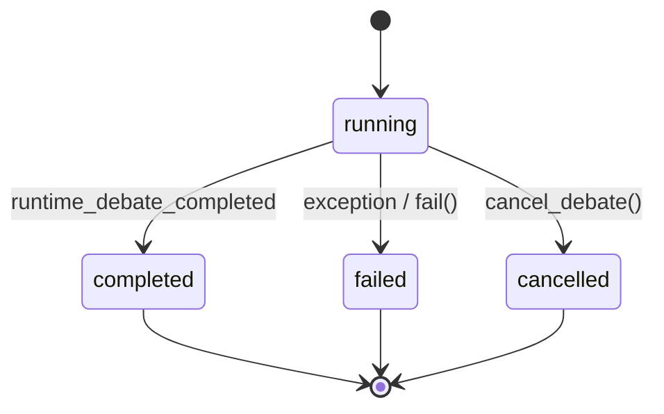

### 9.3 有效结论门禁

当 `DEBATE_REQUIRE_EFFECTIVE_LLM_CONCLUSION=true`：

- 最终结论若是占位（如“需要进一步分析”）会被拒绝。

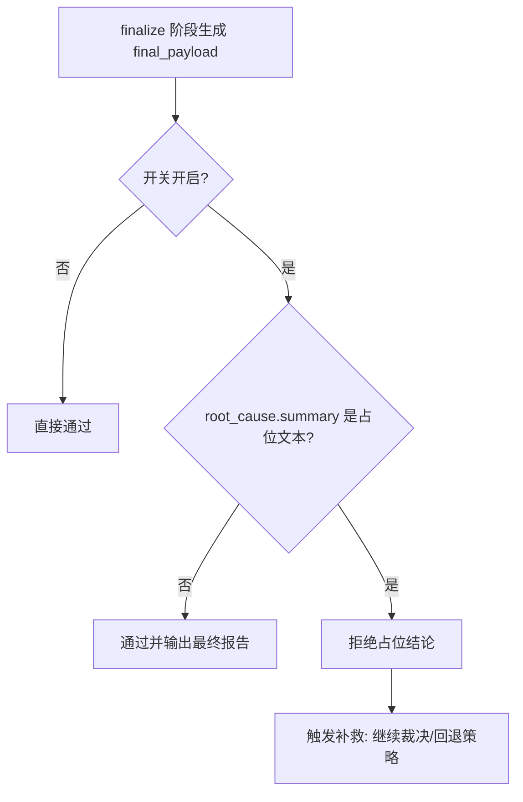

### 9.4 断点续跑

- 事件：`runtime/events/*.jsonl`
- 会话：`runtime/sessions/*.json`
- 心跳：`runtime/tasks.json`
- WS 支持 `resume` 和 `snapshot`

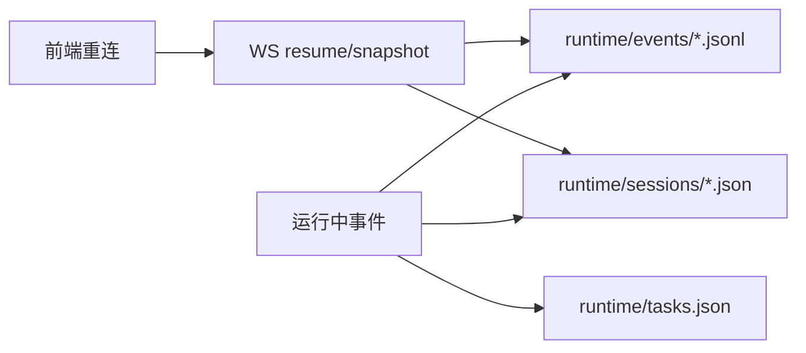

---

## 10. 如何新增一个 Agent（含 Skill 能力）

## 10.1 最小改造路径

1. `specs.py` 新增 AgentSpec。  
2. `builder.py` + `routing_helpers.py` 加 node 映射。  
3. `prompts.py` 更新 commander schema（可选）。  
4. `agent_tool_context_service.py` 新增 `_build_xxx_context` 分支。  
5. 在 `backend/skills/` 新增该 agent 可用 Skill，并设置 `agents:`。  
6. `models/tooling.py` 的 `allowed_agents` 配置允许该 Agent。  
7. 补测试与文档。

### 10.1.1 新增 Agent 实施流程图

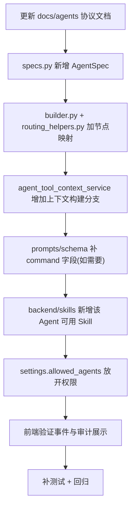

## 10.2 新增 Skill 的最小步骤

1. 新建目录：`backend/skills/<skill-name>/SKILL.md`  
2. 写 front matter：`name/description/triggers/agents`  
3. 写正文：Goal + Checklist + Output Contract  
4. 在主 Agent 命令里加 `skill_hints` 测试命中  
5. 在前端看 `agent_skill_router` 审计是否出现

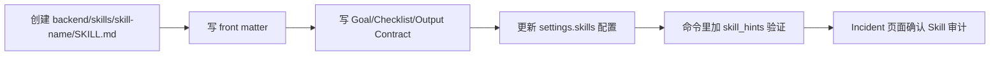

---

## 11. 新手排障清单（Skill 相关）

### 问题 1：为什么 Skill 没生效

检查顺序：

1. `skills.enabled` 是否为 `true`。
2. `skills_dir` 是否正确且目录存在。
3. 当前 Agent 是否在 `allowed_agents`。
4. 是否有主 Agent 命令。
5. 命令是否把 `use_tool` 显式关掉。
6. 审计里是否有 `agent_skill_router` 的 `skill_select` 记录。

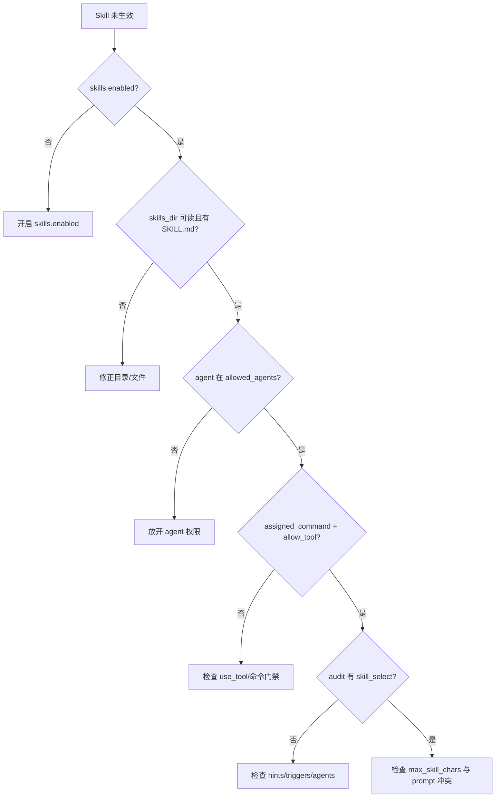

### 问题 2：为什么总是命中不到想要的 Skill

1. 先用 `skill_hints` 显式指定（最稳）。
2. 检查 `SKILL.md` 的 `name` 是否和 hint 一致。
3. 补全 `triggers` 关键词。
4. 确保 `agents:` 包含当前 Agent。

### 问题 3：为什么命中 Skill 了，但输出没变化

1. 看 `max_skill_chars` 是否太小导致内容被截断。  
2. 看 prompt 里是否同时注入了过多上下文导致 Skill 影响被稀释。  
3. 检查该 Agent 的 `system_prompt` 是否与 Skill 指令冲突。

---

## 12. 结语（对新手）

你可以把本系统理解成四层流水线：

1. **主 Agent 指挥**（命令与路由）。
2. **工具与 Skill 提供证据和方法模板**。
3. **LLM 负责推理与生成结构化结果**。
4. **系统负责审计、回放、收敛、终态保障**。

只要沿着“命令 -> 工具门禁 -> skill_context -> LLM -> 结构化输出”这条主链排查，基本都能快速定位问题。
