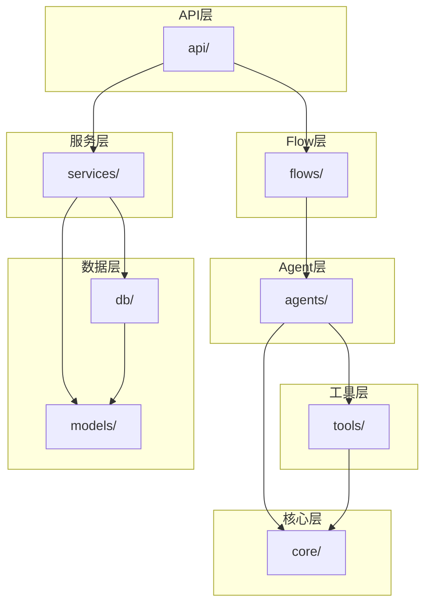

# 项目目录结构说明

## 1. 整体目录结构

```
multi-agent-cli_v2/
├── backend/                          # Python 后端服务
│   ├── app/                          # 应用主目录
│   │   ├── __init__.py
│   │   ├── main.py                   # FastAPI 应用入口
│   │   ├── config.py                 # 配置管理
│   │   ├── dependencies.py           # 依赖注入
│   │   │
│   │   ├── api/                      # API 路由层
│   │   │   ├── __init__.py
│   │   │   ├── router.py             # 路由汇总
│   │   │   ├── incidents.py          # 故障事件 API
│   │   │   ├── assets.py             # 资产管理 API
│   │   │   ├── debates.py            # 辩论流程 API
│   │   │   ├── reports.py            # 报告 API
│   │   │   └── websocket.py          # WebSocket 处理
│   │   │
│   │   ├── agents/                   # Agent 实现层
│   │   │   ├── __init__.py
│   │   │   ├── base.py               # Agent 基类
│   │   │   ├── registry.py           # Agent 注册中心
│   │   │   ├── log_agent.py          # 日志分析 Agent
│   │   │   ├── domain_agent.py       # 领域映射 Agent
│   │   │   ├── code_agent.py         # 代码分析 Agent
│   │   │   ├── critic_agent.py       # 质疑 Agent
│   │   │   ├── rebuttal_agent.py     # 反驳 Agent
│   │   │   └── judge_agent.py        # 裁决 Agent
│   │   │
│   │   ├── flows/                    # Flow 编排层
│   │   │   ├── __init__.py
│   │   │   ├── debate_flow.py        # 辩论流程编排
│   │   │   ├── analysis_flow.py      # 分析流程
│   │   │   └── context.py            # 上下文管理
│   │   │
│   │   ├── tools/                    # 工具层
│   │   │   ├── __init__.py
│   │   │   ├── base.py               # Tool 基类
│   │   │   ├── log_parser.py         # 日志解析工具
│   │   │   ├── git_tool.py           # Git 操作工具
│   │   │   ├── ddd_analyzer.py       # DDD 分析工具
│   │   │   ├── db_tool.py            # 数据库工具
│   │   │   ├── code_search.py        # 代码搜索工具
│   │   │   └── case_library.py       # 案例库工具
│   │   │
│   │   ├── models/                   # 数据模型层
│   │   │   ├── __init__.py
│   │   │   ├── incident.py           # 故障模型
│   │   │   ├── asset.py              # 资产模型
│   │   │   ├── debate.py             # 辩论模型
│   │   │   ├── report.py             # 报告模型
│   │   │   └── case.py               # 案例模型
│   │   │
│   │   ├── services/                 # 业务服务层
│   │   │   ├── __init__.py
│   │   │   ├── asset_fusion.py       # 资产融合服务
│   │   │   ├── case_library.py       # 案例库服务
│   │   │   ├── report_gen.py         # 报告生成服务
│   │   │   └── notification.py       # 通知服务
│   │   │
│   │   ├── core/                     # 核心组件
│   │   │   ├── __init__.py
│   │   │   ├── opencode_client.py    # OpenCode SDK 封装
│   │   │   ├── model_router.py       # 模型路由
│   │   │   ├── cache.py              # 缓存管理
│   │   │   └── security.py           # 安全组件
│   │   │
│   │   ├── db/                       # 数据库相关
│   │   │   ├── __init__.py
│   │   │   ├── session.py            # 数据库会话
│   │   │   ├── repositories/         # 数据仓库
│   │   │   │   ├── __init__.py
│   │   │   │   ├── incident_repo.py
│   │   │   │   ├── debate_repo.py
│   │   │   │   └── case_repo.py
│   │   │   └── migrations/           # 数据库迁移
│   │   │       └── versions/
│   │   │
│   │   └── utils/                    # 工具函数
│   │       ├── __init__.py
│   │       ├── logging.py            # 日志工具
│   │       ├── datetime.py           # 时间工具
│   │       └── validators.py         # 验证器
│   │
│   ├── tests/                        # 测试目录
│   │   ├── __init__.py
│   │   ├── conftest.py               # pytest 配置
│   │   ├── test_main.py
│   │   ├── agents/
│   │   │   ├── __init__.py
│   │   │   ├── test_log_agent.py
│   │   │   └── test_code_agent.py
│   │   ├── tools/
│   │   │   ├── __init__.py
│   │   │   └── test_log_parser.py
│   │   └── flows/
│   │       ├── __init__.py
│   │       └── test_debate_flow.py
│   │
│   ├── scripts/                      # 脚本目录
│   │   ├── init_db.py                # 初始化数据库
│   │   └── seed_cases.py             # 填充案例数据
│   │
│   ├── pyproject.toml                # 项目配置
│   ├── requirements.txt              # 依赖列表
│   ├── pytest.ini                    # pytest 配置
│   └── README.md
│
├── frontend/                         # React 前端
│   ├── src/
│   │   ├── main.tsx                  # 入口文件
│   │   ├── App.tsx                   # 根组件
│   │   ├── vite-env.d.ts
│   │   │
│   │   ├── api/                      # API 请求层
│   │   │   ├── client.ts             # Axios 客户端
│   │   │   ├── incidents.ts          # 故障 API
│   │   │   ├── assets.ts             # 资产 API
│   │   │   ├── debates.ts            # 辩论 API
│   │   │   └── reports.ts            # 报告 API
│   │   │
│   │   ├── components/               # 组件目录
│   │   │   ├── common/               # 通用组件
│   │   │   │   ├── Header/
│   │   │   │   ├── Footer/
│   │   │   │   ├── Loading/
│   │   │   │   └── ErrorBoundary/
│   │   │   │
│   │   │   ├── IncidentInput/        # 故障输入组件
│   │   │   │   ├── index.tsx
│   │   │   │   ├── LogUploader.tsx
│   │   │   │   └── styles.module.css
│   │   │   │
│   │   │   ├── AssetCollector/       # 资产采集组件
│   │   │   │   ├── index.tsx
│   │   │   │   ├── RuntimeCollector.tsx
│   │   │   │   ├── DevCollector.tsx
│   │   │   │   └── DesignCollector.tsx
│   │   │   │
│   │   │   ├── DebateViewer/         # 辩论可视化组件
│   │   │   │   ├── index.tsx
│   │   │   │   ├── DebateTimeline.tsx
│   │   │   │   ├── AgentCard.tsx
│   │   │   │   └── ConfidenceMeter.tsx
│   │   │   │
│   │   │   ├── ReportView/           # 报告展示组件
│   │   │   │   ├── index.tsx
│   │   │   │   ├── RootCauseSection.tsx
│   │   │   │   ├── EvidenceChain.tsx
│   │   │   │   └── FixSuggestions.tsx
│   │   │   │
│   │   │   └── AssetGraph/           # 资产图谱组件
│   │   │       ├── index.tsx
│   │   │       ├── GraphCanvas.tsx
│   │   │       └── NodeDetails.tsx
│   │   │
│   │   ├── pages/                    # 页面目录
│   │   │   ├── Home/                 # 首页
│   │   │   │   ├── index.tsx
│   │   │   │   └── styles.module.css
│   │   │   │
│   │   │   ├── Incident/             # 故障分析页
│   │   │   │   ├── index.tsx
│   │   │   │   ├── CreateIncident.tsx
│   │   │   │   └── IncidentDetail.tsx
│   │   │   │
│   │   │   ├── Assets/               # 资产管理页
│   │   │   │   ├── index.tsx
│   │   │   │   └── AssetList.tsx
│   │   │   │
│   │   │   ├── History/              # 历史记录页
│   │   │   │   ├── index.tsx
│   │   │   │   └── HistoryList.tsx
│   │   │   │
│   │   │   └── CaseLibrary/          # 案例库页
│   │   │       ├── index.tsx
│   │   │       └── CaseDetail.tsx
│   │   │
│   │   ├── stores/                   # 状态管理
│   │   │   ├── index.ts
│   │   │   ├── incidentStore.ts
│   │   │   ├── debateStore.ts
│   │   │   └── uiStore.ts
│   │   │
│   │   ├── hooks/                    # 自定义 Hooks
│   │   │   ├── useIncident.ts
│   │   │   ├── useDebate.ts
│   │   │   ├── useWebSocket.ts
│   │   │   └── useAssets.ts
│   │   │
│   │   ├── types/                    # 类型定义
│   │   │   ├── index.ts
│   │   │   ├── incident.ts
│   │   │   ├── asset.ts
│   │   │   ├── debate.ts
│   │   │   └── report.ts
│   │   │
│   │   ├── utils/                    # 工具函数
│   │   │   ├── format.ts
│   │   │   ├── validation.ts
│   │   │   └── constants.ts
│   │   │
│   │   └── styles/                   # 全局样式
│   │       ├── global.css
│   │       └── variables.css
│   │
│   ├── public/                       # 静态资源
│   │   └── favicon.ico
│   │
│   ├── package.json
│   ├── vite.config.ts
│   ├── tsconfig.json
│   ├── tsconfig.node.json
│   └── index.html
│
├── src/                              # 现有 TypeScript 代码（可复用）
│   ├── models/
│   │   └── tri-state-asset.ts        # 三态资产模型
│   └── index.ts
│
├── docker/                           # Docker 配置
│   ├── docker-compose.yml
│   ├── docker-compose.dev.yml
│   ├── Dockerfile.backend
│   ├── Dockerfile.frontend
│   └── nginx/
│       └── nginx.conf
│
├── docs/                             # 文档目录
│   ├── api/                          # API 文档
│   ├── architecture/                 # 架构文档
│   └── deployment/                   # 部署文档
│
├── plans/                            # 规划文档
│   ├── sre-debate-platform-architecture.md
│   └── implementation-roadmap.md
│
├── scripts/                          # 项目脚本
│   ├── setup.sh                      # 环境初始化
│   └── deploy.sh                     # 部署脚本
│
├── .github/                          # GitHub 配置
│   └── workflows/
│       ├── ci.yml
│       └── deploy.yml
│
├── .env.example                      # 环境变量示例
├── .gitignore
├── package.json                      # 根 package.json
├── tsconfig.json                     # 根 tsconfig.json
└── README.md                         # 项目说明
```

## 2. 目录职责说明

### 2.1 后端目录 (backend/)

| 目录 | 职责 |
|------|------|
| `app/api/` | API 路由定义，处理 HTTP 请求 |
| `app/agents/` | Agent 实现，封装不同专家角色 |
| `app/flows/` | Flow 编排，定义辩论流程 |
| `app/tools/` | 工具实现，供 Agent 调用 |
| `app/models/` | 数据模型定义 |
| `app/services/` | 业务逻辑服务 |
| `app/core/` | 核心组件，SDK 封装等 |
| `app/db/` | 数据库相关，会话、仓库、迁移 |
| `app/utils/` | 通用工具函数 |
| `tests/` | 测试代码 |

### 2.2 前端目录 (frontend/)

| 目录 | 职责 |
|------|------|
| `src/api/` | API 请求封装 |
| `src/components/` | 可复用 UI 组件 |
| `src/pages/` | 页面组件 |
| `src/stores/` | 状态管理 |
| `src/hooks/` | 自定义 React Hooks |
| `src/types/` | TypeScript 类型定义 |
| `src/utils/` | 工具函数 |
| `src/styles/` | 全局样式 |

### 2.3 其他目录

| 目录 | 职责 |
|------|------|
| `docker/` | Docker 配置文件 |
| `docs/` | 项目文档 |
| `plans/` | 规划和设计文档 |
| `scripts/` | 自动化脚本 |
| `.github/` | GitHub Actions 配置 |

## 3. 文件命名规范

### 3.1 Python 文件
- 模块文件：小写下划线命名 `log_agent.py`
- 类名：大驼峰命名 `LogAgent`
- 函数/方法：小写下划线命名 `process_log()`
- 常量：大写下划线命名 `MAX_ROUNDS`

### 3.2 TypeScript/React 文件
- 组件文件：大驼峰命名 `DebateViewer.tsx`
- 工具文件：小写下划线命名 `format.ts`
- 类型文件：小写下划线命名 `incident.ts`
- 样式文件：小写下划线命名 `styles.module.css`

## 4. 模块依赖关系



## 5. 初始化命令

```bash
# 创建后端目录结构
mkdir -p backend/app/{api,agents,flows,tools,models,services,core,db/repositories,db/migrations/versions,utils}
mkdir -p backend/tests/{agents,tools,flows}
mkdir -p backend/scripts

# 创建前端目录结构
mkdir -p frontend/src/{api,components/{common,IncidentInput,AssetCollector,DebateViewer,ReportView,AssetGraph},pages/{Home,Incident,Assets,History,CaseLibrary},stores,hooks,types,utils,styles}
mkdir -p frontend/public

# 创建其他目录
mkdir -p docker/nginx
mkdir -p docs/{api,architecture,deployment}
mkdir -p .github/workflows
```
